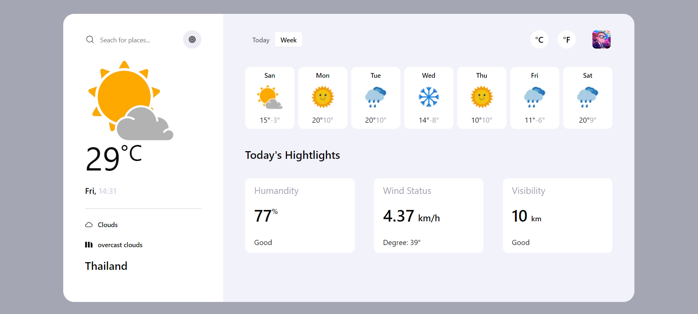

# Weather App
## Credit: [Anton Mihalcov](https://dribbble.com/mikhaltsov23)

To run project
1. Clone this progect using `git clone - [git repo name]`
2. Install all dependencies `npm i` or `npm install`
3. Run project `npm run dev`

The default location will be in Thailand
> For the 7 days cards use mock data.

## Demo [Weather-app](https://weather-app-vercel-phi.vercel.app/)
